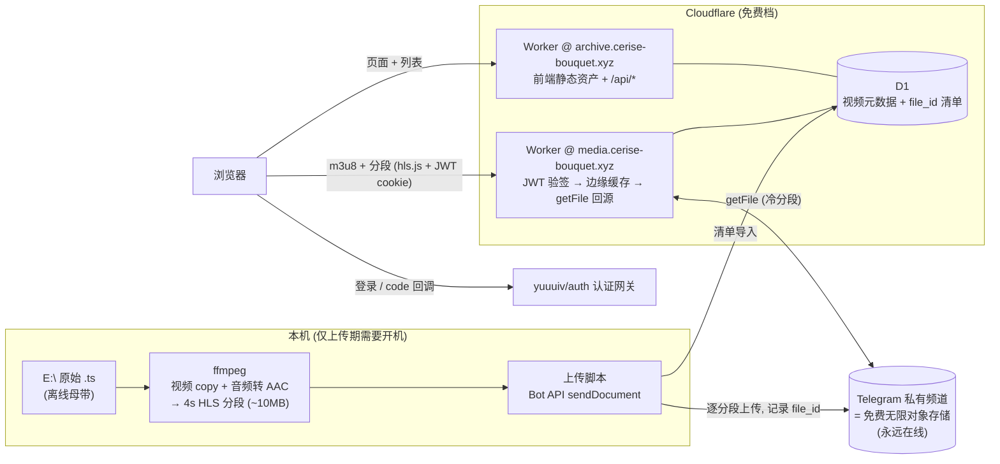

# archive.cerise-bouquet.xyz 架构设计

零付费 · 自建 Telegram 存储。个人视频档案站，产品形态参考 [awsl-project/awsl-video](https://github.com/awsl-project/awsl-video)。约束与前提：

- **全程 $0**：不买对象存储（R2 免费档仅 10 GB 不够）、不租服务器；
- **源机不常在线**：视频在外接硬盘 `E:\`，电脑不常开 → 排除 Tunnel 自托管，存储必须"永远在线"；
- 自用站点，接入 [yuuuiv/auth](https://github.com/yuuuiv/auth) 认证网关，无版权顾虑；
- 数据规模：25 个 `.ts` 直录（H.264 1080p30 / ~20 Mbps / AAC-LATM），266 GB，最大单文件 54.4 GB。

## 1. 核心思路：AWSL Telegram Storage 不是"条件"，是可以自建的一段代码

awsl-video 的存储层本质是：**免费 Telegram 账号 = 无限量、永远在线的对象存储**，外面包一层"分片上传 / 按片取回"的胶水服务。这层胶水我们用一个 Cloudflare Worker 自建，总量约百来行代码：

- 视频切成 **~10 MB 的 HLS 分段**，由本地脚本经 Bot API 上传到一个**私有频道**；
- 每个分段的 `file_id` 记入清单，导入 D1；
- 播放时 Worker 按需用 `getFile` 从 Telegram 取回分段，**并缓存在 Cloudflare 边缘**——热内容命中边缘节点不再回 Telegram，冷内容首次取回约 1–3 秒。

观看者**完全不接触 Telegram**（Worker 在 Cloudflare 侧访问 api.telegram.org，无网络环境问题）；只有上传脚本在你电脑上运行时需要能访问 Telegram API。上传完成后，`E:\` 恢复为纯离线母带备份。

## 2. 方案对比（免费且"永远在线"的筛选过程）

| 方案 | 结论 | 原因 |
|---|---|---|
| R2 免费档 10 GB | ❌ | 容量差 25 倍 |
| 本机 + Cloudflare Tunnel | ❌ | 外接硬盘、电脑不常开 → 源站不在线 |
| 免费网盘 + alist 直链 | ❌ | 限速、直链时效、规则多变，且 alist 需常驻运行环境 |
| Oracle 等免费云主机 | ❌ | 免费存储 ≤200 GB 不够，账号回收风险 |
| YouTube 不公开视频（备选） | ⚠️ | 零运维、无限容量，但强制重编码损画质、观看依赖网络环境、站点整合弱 |
| **自建 Telegram 存储（本方案）** | ✅ | $0、容量无限、永远在线、保原画质（视频流不重编码）、与范例项目同源思路已被验证可行 |

已知风险（与 awsl-video 完全相同，如实列出）：属于对 Telegram 的非常规用法，理论上存在限流或封禁可能。缓解：`E:\` 原始 `.ts` 永久保留为母带，清单（slug ↔ file_id 映射）随时可导出，最坏情况重新上传或迁移 R2（见 §9），**不存在数据丢失风险，只有重传成本**。

## 3. 总体架构



与范例项目的映射：

| awsl-video | 本项目 |
|---|---|
| AWSL Telegram Storage 服务 | **自建**：上传脚本 + media Worker + D1 清单 |
| 10 MB 分片 + 后端流式重组 | 标准 HLS 4s 分段（~10 MB），hls.js 原生按段拉取，无需重组 |
| FastAPI + PostgreSQL | Cloudflare Worker + D1 |
| Vercel 部署 | Cloudflare Workers |
| OAuth (GitHub/Linux.do) | yuuuiv/auth 网关 |

## 4. 关键限制核算（决定设计参数）

| Telegram / Cloudflare 限制 | 数值 | 应对 |
|---|---|---|
| Bot 下载单文件上限 | **20 MB** | `hls_time=4` → 平均 10.2 MB/段，VBR 峰值有余量；处理脚本校验任何 >19 MB 的分段并报警 |
| Bot 上传单文件上限 | 50 MB | 无压力 |
| 同一频道发消息速率 | ~20 条/分钟 | 上传脚本限速；全量 2.7 万段 ≈ 22 小时，分几晚跑完 |
| `getFile` 返回的 file_path 有效期 | ~1 小时 | Worker 将 file_path 缓存 50 分钟（KV 或 Cache API），减少一次往返 |
| Workers 免费额度 | 10 万请求/天 | 6 小时视频 ≈ 5400 段/次完整观看 → 约 18 次完整观看/天，自用足够 |
| D1 免费额度 | 500 万行读/天 | 每段一次查询，远够 |
| 边缘缓存单对象上限（免费档） | 512 MB | 10 MB 分段远低于 |

## 5. 各层设计

### 5.1 预处理（本地，一次性）

视频 H.264 直接 copy（不重编码，速度≈磁盘 IO）；音频 `aac_latm` 浏览器不认，转标准 AAC：

```powershell
ffmpeg -i "E:\input.ts" `
  -c:v copy -c:a aac -b:a 192k `
  -f hls -hls_time 4 -hls_playlist_type vod `
  -hls_segment_filename "work\<slug>\seg_%05d.ts" `
  "work\<slug>\master.m3u8"
```

另截取封面帧 `poster.jpg`。m3u8 中分段路径由脚本改写为 `https://media.cerise-bouquet.xyz/<slug>/seg_00001.ts` 形式。

### 5.2 上传脚本（本地，Python/Node 均可）

1. 创建 Telegram bot（@BotFather，免费）+ 私有频道，bot 设为频道管理员；
2. 逐段 `sendDocument` 到频道（限速 ≤20 条/分钟），响应中记录 `file_id`；
3. 产出清单 `manifest.json`：`{slug, seg_index → file_id, m3u8 内容, poster file_id, 标题/日期/时长}`；
4. `wrangler d1 execute` 导入清单。支持断点续传（已上传的段跳过）。

### 5.3 media Worker（media.cerise-bouquet.xyz）

每个请求的处理链（含缓存命中，鉴权永不被绕过）：

1. **JWT 验签**：校验 `HttpOnly; Domain=.cerise-bouquet.xyz` cookie 中的 JWT（auth 网关 app secret 本地 HMAC 验签，不调用认证服务）；失败 → 401；
2. **边缘缓存查询**（Cache API，分段内容不可变，TTL 1 个月）→ 命中直接返回；
3. **回源**：D1 查 `file_id` → `getFile` 拿 file_path（有 50 分钟缓存）→ 从 `api.telegram.org/file/bot<token>/…` 流式取回 → 写入边缘缓存并返回；
4. m3u8 与 poster 同理（体积小，同样缓存）；
5. CORS：`Access-Control-Allow-Origin: https://archive.cerise-bouquet.xyz` + `Allow-Credentials`。

Bot token、auth app secret 均存 Worker Secret。

### 5.4 站点 Worker（archive.cerise-bouquet.xyz）

- 静态资产：React 19 + TypeScript + Vite + Tailwind + shadcn/ui（沿用范例前端），播放器 hls.js（`xhrSetup` 开 `withCredentials`）；
- API：`GET /api/videos`、`GET /api/videos/:id`（读 D1）；
- 认证路由（yuuuiv/auth 标准流程）：
  - `GET /api/login` → 302 认证网关（带 `app_id`）；
  - `GET /api/callback?code=…` → 服务端以 code + app secret 换 JWT → 写入跨子域 cookie（archive 与 media 共用）。

### 5.5 观看体验预期

- 已缓存（边缘热）分段：即点即播、拖动即时——与对象存储方案无差别；
- 冷分段：首次约 1–3 秒取回延迟，hls.js 有预取缓冲，顺序观看基本无感；随机拖到全片冷区时会有短暂缓冲；
- 原码率 20 Mbps 由 Telegram → Cloudflare → 观看者链路承载，无家庭上行瓶颈（对比 v2 方案的最大改善）。

## 6. 成本

| 项目 | 费用 |
|---|---|
| Telegram 存储（私有频道） | $0，容量无限 |
| Cloudflare Workers / D1 / DNS / 缓存 | $0（免费档） |
| 本地 ffmpeg / 上传脚本 | $0（电脑仅上传期开机） |
| **合计** | **$0/月** |

## 7. 仓库结构（本仓库）

```
archive/
  ARCHITECTURE.md          # 本文档
  frontend/                # React 19 + Vite + Tailwind + shadcn/ui + hls.js
  workers/
    site/                  # archive.cerise-bouquet.xyz：静态资产 + /api/* + auth 路由
    media/                 # media.cerise-bouquet.xyz：JWT 验签 + 缓存 + Telegram 回源
  scripts/
    process.ps1            # ffmpeg 切片 + 段大小校验 + 封面
    upload.py              # Bot API 限速上传 + 断点续传 + 生成清单
    import-manifest.ps1    # 清单导入 D1
  schema/                  # D1 建表 SQL
  manifests/               # 各视频清单备份（slug ↔ file_id 映射，勿丢）
```

## 8. 实施路线

1. **验证内核**（半天）：建 bot + 私有频道；手工上传 3 个分段；写最小 media Worker（先硬编码 file_id、跳过鉴权）→ 浏览器 hls.js 播通，确认取回延迟可接受。**这是全方案唯一的技术风险点，最先验证。**
2. **流水线**：`scripts/process.ps1`（切片 + 校验段大小 + 封面）与 `scripts/upload.py`（限速上传 + 断点续传 + 清单），先端到端跑一个最小的视频。
3. **站点**：D1 建表导清单；前端列表页 + 播放页；`wrangler deploy` 两个 Worker。
4. **接入 auth**：注册 `app_id`，实现 login/callback/跨子域 cookie，media Worker 加验签联调。
5. **批量迁移**：25 个文件分批过夜处理 + 上传（约 22 小时净上传时间）。
6. **收尾**：清单备份（git 仓库内加密或私有存放）、上传脚本收编进仓库、`E:\` 母带归档。

## 9. 未来出口（架构已预留）

media Worker 的"回源"是唯一与 Telegram 耦合的环节。若 Telegram 途径失效或某天愿意付费：

- 把 `work\` 下的 HLS 分段 rclone 到 **R2**（266 GB ≈ $4/月），Worker 回源改为 R2 绑定，**其余全部不变**；
- 清单与母带俱在，迁移只是重传，不存在数据风险。
